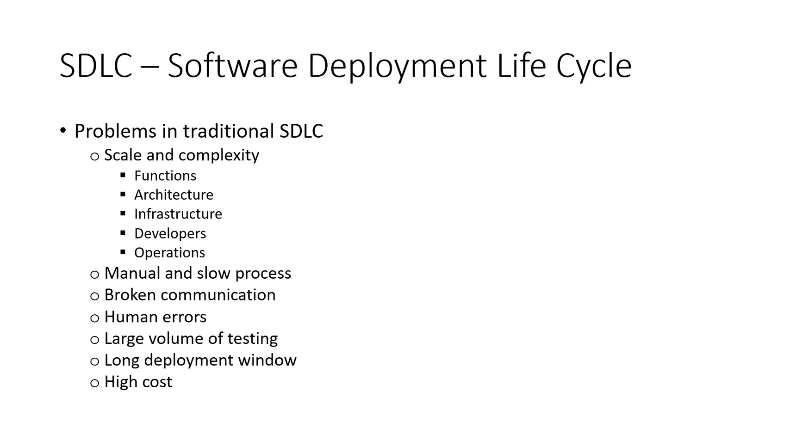

# CI-CD with Jenkins

### Build CI/CD with Jenkins and GitHub





Create a README about

What is CICD
Best practices
What are the tools available to create CICD pipeline
difference between Continuous delivery and continuous deployment

# Deployment lab

## you should have three job

job to merge CI from dev to main if the tests passed
job to deploy on aws ec2 once the code is merged to main

## Timings

30 - 60 Minutes

## Summary

We've followed some manual steps to get our code on to the production environment. But we should really automate this process

Create a new jenkins job called Your Name Deploy. Set it up so that it performs the steps you just ran through.

Set this job to run when the CI testing job has finished successfully.

Make a change to the homepage of the app and push your code to the develop branch to test out your pipeline.

## Notes & tips

This job should pull from the master branch only.

There are many tools and methods for uploading files to a remote server. We want to keep it simple and use rsync and ssh as we've learned previously. Do not use the Publish over SSH plugins.

You can create this configuration entirely in your job using:

ssh
rsync
ssh-agent
credentials system

When jenkins attempts to connect via SSH it will ask for confirmation as we saw in the lesson. We can ask it to skip this confirmation with the following flags:

```
ssh -o "StrictHostKeyChecking=no" ubuntu@ ...
rsync -avz -e "ssh -o StrictHostKeyChecking=no" ...
```

You can send multiple commands over ssh with the following syntax

```
ssh -o "StrictHostKeyChecking=no" ubuntu@52.50.22.47 <<EOF

	commands here...

EOF
```

## Acceptance Criteria

- is it's own job on Jenkins
- Trigger is set to successful merge and publish of code
- Automatically transfer files into live server on EC2

# AWS S3 task

There are other ways of completing the same jobs but we looked at the very basic and commonly used features and functions of S3 bucket.
Exercise:

Launch new EC2 ubuntu instance :
Next:
Research the documentation on AWS/Python for python boto3 package to create and manage AWS S3 resources and complete all the following tasks
DOD:

Setting up awscli and python Env with required dependencies
S3 authentication setup - with aws configure on EC2
Create S3 bucket using python-boto3
Upload data/file to S3 bucket using python-boto3
Retrieve content/file from S3 using python-boto3
Delete Content from S3 using python-boto3
Delete the bucket using python-boto3.\*\*

```
rsync -avz -e "ssh -o StrictHostKeyChecking=no" app ubuntu@52.50.22.47:/home/ubuntu
rsync -avz -e "ssh -o StrictHostKeyChecking=no" environment ubuntu@52.50.22.47:/home/ubuntu
ssh -o "StrictHostKeyChecking=no" ubuntu@52.50.22.47 <<EOF
	sudo bash ./environment/provision.sh
    cd app
    pm2 kill
    pm2 start app.js
EOF
```

# How to create a Jenkins CI/CD pipeline

## Step 1: Generate a Public/Private key pair

1. Generate a new ssh key with this command `ssh-keygen -t rsa -b 4096 -C "the_email_address_you_signed_up_to_github_with"`
   If you are using a legacy system that doesn't support the Ed25519 algorithm, use:`ssh-keygen -t rsa -b 4096 -C "your_email@example.com"`
2. Next navigate to `~/.ssh` directory
3. Display the public key using `cat` or `nano` command and copy the key contents
4. On the GitHub repository, go on **Settings**
5. Click on **Deploy keys** > **Add deploy key**
6. Enter a title and paste the key
7. Check **Allow write access** and click **Add key**

## Step 2: Create a Webhook

1. On your online repository, click on **Setting**
2. Click on **Webhooks** > **Add webhook**
3. Enter the Payload URL as `http://jenkins_ip:8080/github-webhook/`
4. For the Content type, select `apllication/json`
5. For the events to trigger, select **Send me everything**
6. Check **Active** and click **Add webhook**

## Step 3: Creating Jenkins Jobs

1. On the Jenkins Dashboard, click on **New Item**
2. Enter a the name in convetion for the job
3. Select **Freestyle project**
4. Click **Ok**
5. Create a job for CI, merging and deployment

## Step 4: Continuous Integration (CI) Job

### General

1. Click **Discard old builds** and keep the max number of build to 2
2. Click **GitHub project** and add the HTTP URL of the repository

### Office 365 Connector

- Click **Restrict where this project can be run**, then set it as `sparta-ubuntu-node`

### Source Code Management

1. Select **Git**
2. In **Repositories**:
   - **Repository URL:** insert the SSH URL from GitHub
   - **Credentials:**
     - Next to **Credentials**, click **Add** > **Jenkins**
     - Select **Kind** as **SSH Username with private key**
     - Set a suitable description and enter the private key directly. The private key is in your `~/.ssh` directory. Ensure that the begin and end text of the key is included.
     - With the _credential_ added, select the one you created
   - **Branches to build:** set to `*/dev` (dev branch)

### Build Triggers

- Click **GitHub hook trigger for GITScm polling**

### Build Environment

- Click **Provide Node & npm bin/ folder to PATH**

### Build

1. Click **Add build step** > **Execute Shell**
2. In command, enter the following code:

```
cd app
npm install
npm test
```

### Post-build Actions

1. Select **Add post-build action** > **Build other projects**
2. Insert the project name for the merge job
3. Ensure **Trigger only if build is stable** is selected

## Step 5: Merge Job

### General

1. Click **Discard old builds** and keep the max number of build to 2
2. Click **GitHub project** and add the HTTP URL of the repository

### Office 365 Connector

- Click **Restrict where this project can be run**, then set it as `sparta-ubuntu-node`

### Source Code Management

1. Select **Git**
2. In **Repositories:**
   - **Repository URL:** insert the SSH URL
   - **Credentials:** select the credential you created earlier
   - **Branches to build:** set to `*/dev` (dev branch)

### Build Environment

- Select **Provide Node & npm bin/ folder to PATH**

### Post-build Actions

1. First, select **Add post-build action** > **Git Publisher**
2. Click **Push Only If Build Succeeds**
3. In **Branches**:
   - **Branch to push:** main
   - **Target remote name:** origin
4. Next, select **Add post-build action** > **Build other projects**
5. Insert the project name for the deploy job
6. Ensure **Trigger only if build is stable** is selected
7. Ensure the **Build other projects** block is below the **Git Publisher** block

## Step 6: EC2 Instance for Deployment

We will deploy our application on an EC2 instance.

1. Create a new EC2 instance
2. Choose `Ubuntu Server 16.04 LTS (HVM), SSD Volume Type` as the AMI
3. Choose `t2.micro` as the instance type (the default)
4. On Configure Instance Details:
   - Change the VPC to your VPC
   - Change subnet to your public subnet
   - Enable `Auto-assign Public IP`
5. Add a tag with the `Key` as `Name` and enter an appropriate name as the value
6. Enter a suitable name and description for the Security Group with the following rules:
   - SSH (22) with source `My IP` - allows you to SSH
   - SSH (22) with source `jenkins_server_ip/32` - allows Jenkins server to SSH
   - HTTP (80) with source `Anywhere` - allow access to the app
   - Custom TCP (3000) with source `0.0.0.0/0` - allow access to port 3000
7. Review and Launch
8. Select the existing DevOpsStudent key:pair option for SSH
9. Ensure the public NACL allows SSH (22) with source `jenkins_server_ip/32`
10. If the Jenkins server updates/reboots, the GitHub webhook, security group and NACL need to be modified

## Step 7: Continuous Deployment Job

### General

1. Click **Discard old builds** and keep the max number of build to 2
2. Click **GitHub project** and add the HTTP URL of the repository

### Office 365 Connector

- Click **Restrict where this project can be run**, then set it as `sparta-ubuntu-node`

### Source Code Management

- Keep it at **None**

### Build Environment

1. Select **Provide Node & npm bin/ folder to PATH**
2. Select **SSH Agent**:
   - Select **Specific credentials**
   - Select the SSH key for the EC2 instance (DevOpsStudent in this case)

### Build

1. Select **Add build step** > **Execute Shell**
2. In command, insert the following code:

   ```
   rm -rf eng84_cicd_jenkins*
   git clone -b main https://github.com/Olejekglejek/CI_CD_Jenkins.git

   rsync -avz -e "ssh -o StrictHostKeyChecking=no" app ubuntu@deploy_public_ip:/home/ubuntu/app
   rsync -avz -e "ssh -o StrictHostKeyChecking=no" environment ubuntu@deploy_public_ip:/home/ubuntu/app

   ssh -A -o "StrictHostKeyChecking=no" ubuntu@deploy_public_ip <<EOF

       # 'kill' all running instances of node.js
       killall npm

       # run provisions file for dependencies
       cd /home/ubuntu/app/environment/app
       chmod +x provision.sh
       ./provision.sh

       # Install npm for remaining dependencies
       cd /home/ubuntu/app/app
       sudo npm install
       node seeds/seed.js

       # Run the app
       node app.js &

   EOF
   ```

3. NOTE: the `deploy_public_ip` will need to be changed each time you re-run the deployment EC2 instance

## Step 8: Trigger the Builds!

1. Switch to the `dev` branch
2. Make any change to your repository
3. Add, commit and push your changes to the `dev` branch
4. A CI build will trigger
5. A merge build will only trigger if the tests in the CI build pass
6. After the merge build, the `dev` branch will merge with your `main` branch on GitHub
7. If the deployment build succeeds, the app will be running on its public IP!
8. NOTE: the image will only display if you access port 3000

## Bonus Step: Running in Vagrant

1. Run both the app and database using `vagrant up app` and `vagrant up db` respectively on separate terminals
2. SSH into the app using `vagrant ssh app`
3. Navigate to the `/home/ubuntu/` directory (you are placed in `/home/vagrant/` by default)
4. Go to the `/home/ubuntu/app/app` directory and run `node seeds/seed.js` to populate the database
5. Run `npm install` for any remaining dependencies
6. Execute `node app.js` to run the app
7. On a web browser, enter `development.local:3000` to show that the app is _working_
8. The posts page will open with `development.local:3000/posts`

**Test**
